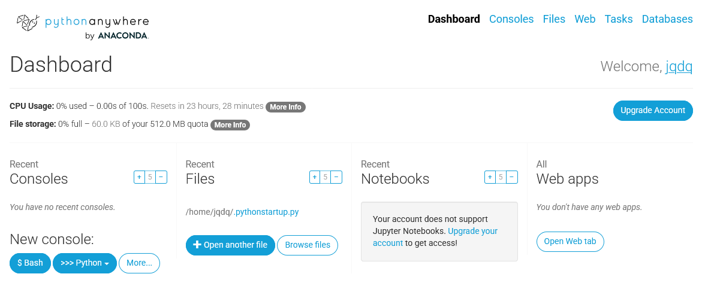
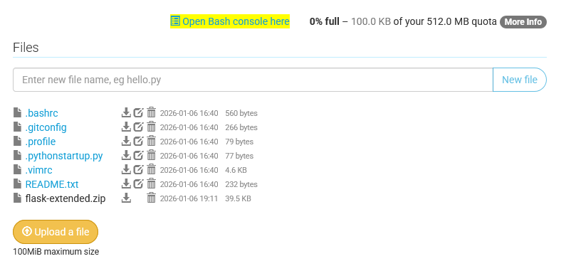
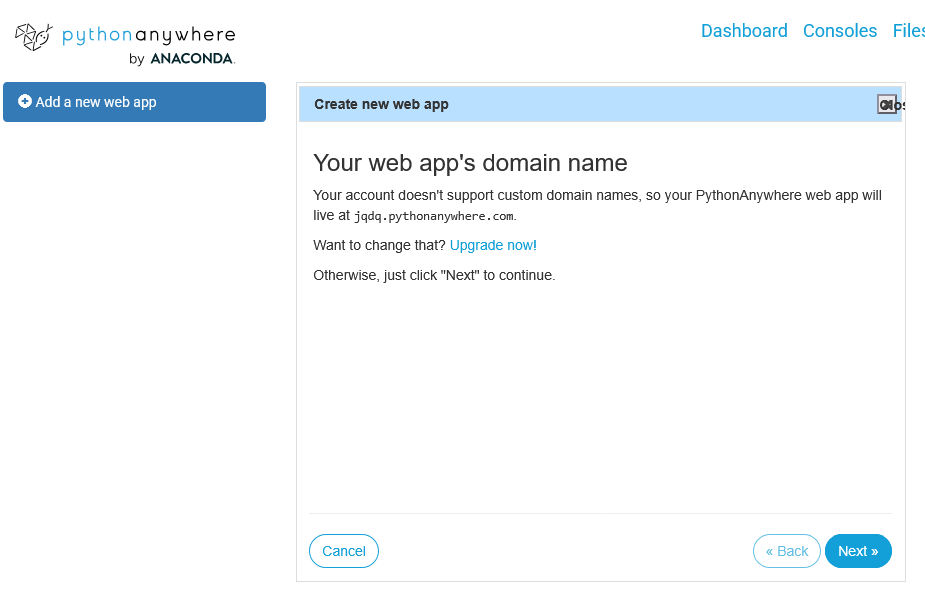
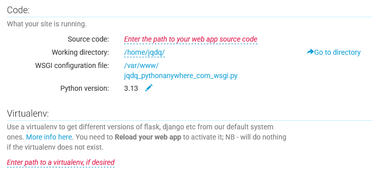

# Deploying your project on `pythonanywhere.com`

In this guide, we'll go through the steps to deploy a Flask project on `pythonanywhere.com`. This service will assign you a free subdomain (`yourusername.pythonanywhere.com`), and host the application for you. They will do it for free, as long as your application doesn't exceed certain resource limits (it shouldn't for most small projects).

That said, creating production-ready applications requires a lot of considerations that are outside the scope of this guide. Things like:

- Security (defending against attacks, blocking bots, securing user data, etc.)
- Backups and recovery (trust me, you'll need it)
- Monitoring and scaling when needed
- Domain names and SSL certificates
- Deployment workflows
- Performance optimization

This is usually handled by DevOps engineers, or by using specialized services. Other tasks, like revenue generation, content moderation, legal compliance, etc. are also carried out by more business-oriented teams, assuring our project won't become a liability :)

## You'll need

 - A Flask project, similar to `flask-extended`
 - A free `pythonanywhere.com` account

## Uploading the project

If you use GitHub, you can clone your repository directly on `pythonanywhere.com` using the Bash console, as long as your repository is public. You can find instructions on how to do that in the [GitHub documentation](https://docs.github.com/en/repositories/creating-and-managing-repositories/cloning-a-repository). Otherwise, you can upload your project files as a zip file using the file manager. We'll cover this method here.

### Zipping your project

First, zip your project folder on your local machine:

1. Remove the instance folder - I'll explain how to recreate the database later. 
2. Click with the right mouse button on your project folder.
3. Select the option to compress it (the exact wording will depend on your operating system).

You should end up with a zip file of a structure similar to this:

```
flask-extended
|-- models
|   |-- init_db.py
|   |-- user.py
|   |-- ...
|-- templates
|   |-- auth
|   |   |-- login.html
|   |   |-- register.html
|   |-- index.html
|   |-- base.html
|   |-- ...
|-- static
|-- app.py
|-- auth.py
|-- ...
```

It's important that the zip file contains the project folder at the root level, and not the contents of the project folder directly!

You can check the contents of your zip file using the explorer/finder on your machine, or with [this](https://www.ziptreeviewer.com/) website.

### Uploading the zip file

Log in to your `pythonanywhere.com` account.
After logging in to your `pythonanywhere.com` account, you should see this:



Click on the **Files** tab at the top, or on the **Browse files** button. This will take you to a file manager interface.
There, select the zip file you created earlier and upload it. You should see the zip file appear in the file list.

### Unzipping the project

You won't be able to unzip the file using the file manager interface, so you'll need to open a Bash console. You can do this by clicking on the **Open Bash console here** button at the top of the file manager page.



You should end up in a terminal interface. There, you can verify that the zip file is present by running:

```bash
ls
```

You should see your zip file listed there. Now, you can unzip it using the `unzip` command:

```bash
unzip your_project_file.zip
```

Now, you should see a new folder with your project files. You can verify this by running `ls` again. 

You can also navigate into the folder using `cd your_project_folder` and run `ls` again to see the project structure. You can return to parent directories using `cd ..`.

```
~ $ cd flask-extended

~/flask-extended $ ls
README.md  __pycache__  app.py  auth.py  models  movie_ratings.py  static  templates

~/flask-extended $ cd ..

~ $ ls
README.txt  flask-extended  flask-extended.zip
```

## Setting up the web application

Now that your project files are uploaded, it's time to set up the web application. This will involve:
- Creating a virtual environment
- Installing dependencies
- Configuring the app

### Creating a virtual environment

Virtual environments are a way to isolate your project's dependencies from the system-wide Python installation. When you create and activate a virtual environment, any packages you install will only be available within that environment.

If you closed the Bash console earlier, open a new one by clicking the **Bash** button in the **Consoles** tab of the dashboard.

Here, create a virtual environment using the following command (this is a `pythonanywhere.com` specific command):

```bash
mkvirtualenv --python=/usr/bin/python3.13 my-virtualenv
```

This will work for a bit. After it finishes, you should see the name of your virtual environment in parentheses at the beginning of the command prompt, like this:

```
(my-virtualenv) 12:00 ~ $
```

Later, when you open a new Bash console, you can activate the virtual environment using the `workon` command:

```bash
12:00 $ ~ workon my-virtualenv
(my-virtualenv) 12:00 ~ $
```

Look at the output of the command. You should see a line that says something like:

```
virtualenvwrapper.user_scripts creating /home/username/.virtualenvs/my-virtualenv/bin/predeactivate
```

Save the `/home/username/.virtualenvs/my-virtualenv/` part - you'll need it later.

### Installing dependencies

You can install your project's dependencies using `pip`. If the you didn't add any extra dependencies (compared to the `flask-extended` project), you can install them using the following command:

```bash
pip install Flask Flask-WTF Flask-SQLAlchemy
```

### Configuring the app

In a new browser tab, go to the **Web** tab in the `pythonanywhere.com` dashboard. There, click on the **Add a new web app** button. You will see a wizard that will guide you through the process.



1. Click on the **Next** button.
2. Select **Manual configuration**
3. Select **Python 3.13** as the Python version.
4. Click on the **Next** button.
5. Wait for the web app to be created. You will be taken to a configuration page.

Here, scroll down to the **Code** section:



Set the fields by clicking on them:

- **Source code**: Set this to the path of your project folder. It should be something like `/home/yourusername/your_project_folder`.
- **Working directory**: Set this to the same path as above.
- **Virtualenv**: Set this to the path of your virtual environment that you saved earlier. It should be something like `/home/yourusername/.virtualenvs/my-virtualenv`.

#### Configuring the WSGI file

WSGI (Web Server Gateway Interface) is a specification that allows web servers to communicate with web applications. `pythonanywhere.com` uses WSGI to serve your Flask application.

Click on the **WSGI configuration file** link in the **Code** section. This will open the WSGI file in an editor.

Delete the contents of the file and replace it with the following code, adjusting the paths as needed:

```python
import sys
path = '/home/yourusername/your_project_folder'
if path not in sys.path:
   sys.path.insert(0, path)

from app import app as application
```

Save the file and exit the editor. Back in the web app configuration page, click on the **Reload** button at the top to apply the changes. Your web application should now be configured!

## Recreating the database

Since we didn't upload the `instance` folder, we need to recreate the database. To do this, follow these steps:

1. Go back to the Bash console (or open a new one).
2. Make sure your virtual environment is activated.
3. Navigate to your project folder. If you're already in the project folder (there is a `$ ~/your_project_folder` next to the cursor), you should skip this step.

```bash
cd ~/your_project_folder
```

Now, run the following command to create the database (this assumes you built your project similar to `flask-extended`):

```bash
python app.py setup
```

This will create a new `instance` folder with a fresh database.

You can close the Bash console now by typing `exit`, pressing Enter, and closing the tab.

## Everything's ready!

That's it! Your Flask application should now be deployed and running on `pythonanywhere.com`. You can visit your web app by going to `yourusername.pythonanywhere.com` in your browser.

If there are any issues, you can check the error logs by going to the **Web** tab in the dashboard and clicking on the **Error log** link.

## Redeploying changes

When you make changes to your project, you'll need to redeploy them to `pythonanywhere.com`. You can do this by following these steps:

1. Zip your project folder again (excluding the `instance` folder if you want to keep the database intact).
2. Upload the new zip file using the file manager (delete the old one first if you want to avoid confusion).
3. Open a Bash console.
4. Remove the old project folder: `rm -rf your_project_folder`
5. Unzip the new zip file: `unzip your_new_project_file.zip`
6. Recreate the database if needed (see the previous section).
7. Reload the web app from the **Web** tab in the dashboard.

Basically, you just repeat the steps you followed to deploy the project the first time, but skipping the configuration steps.